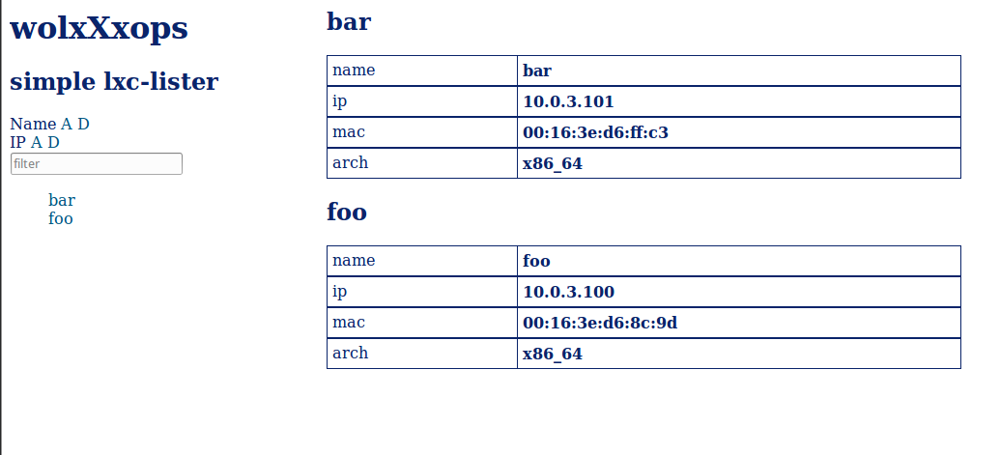

lxclister
=========
 
simple lxc lister 
 
puts your containers into containers.js 
enjoy easy overview. without any servers. just plain & native html, css, javascript. 
to get the containers.js list filles, simply run grab.sh in a terminal.. 
 

